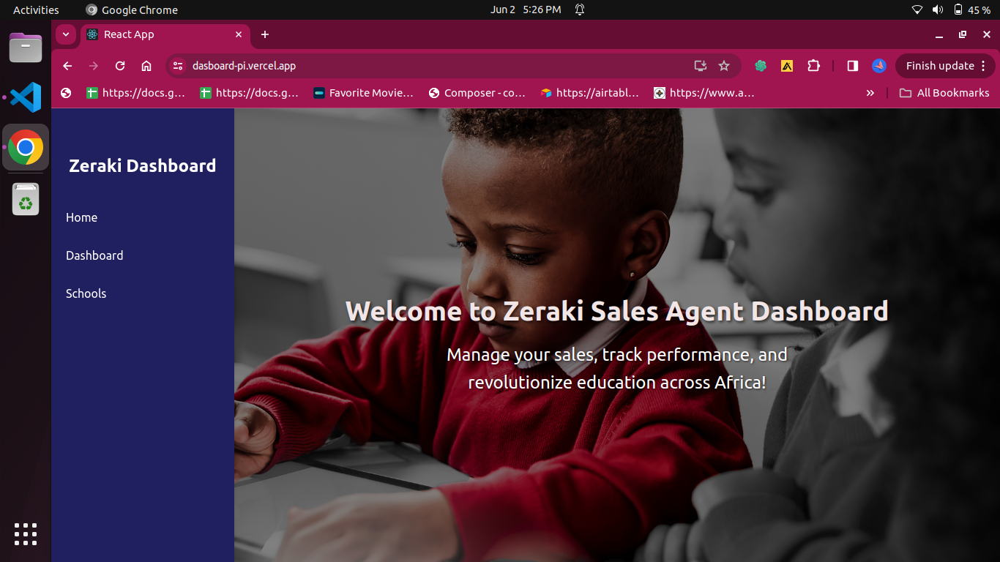
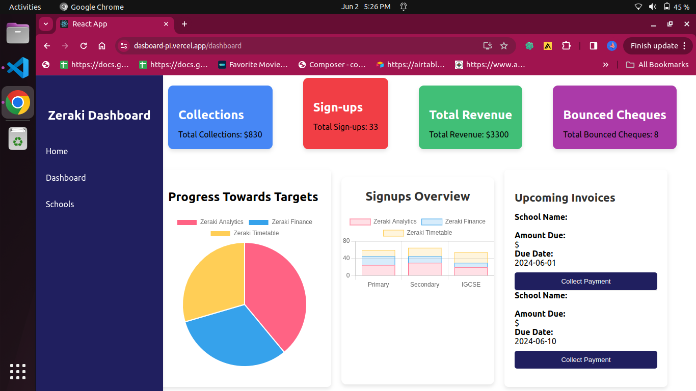
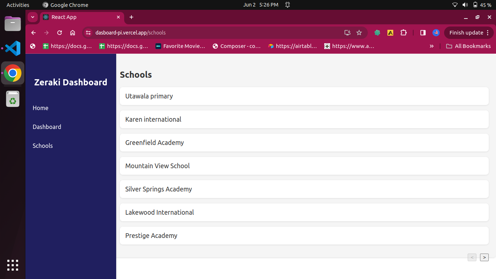
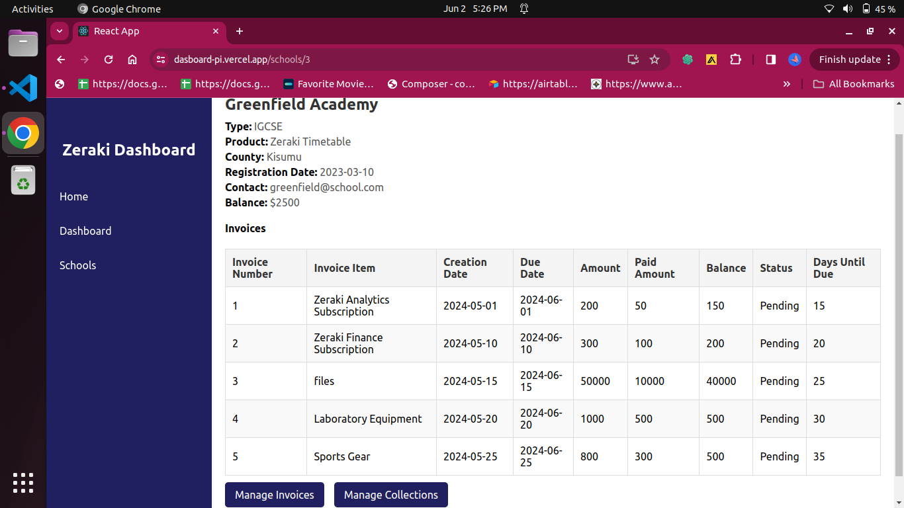
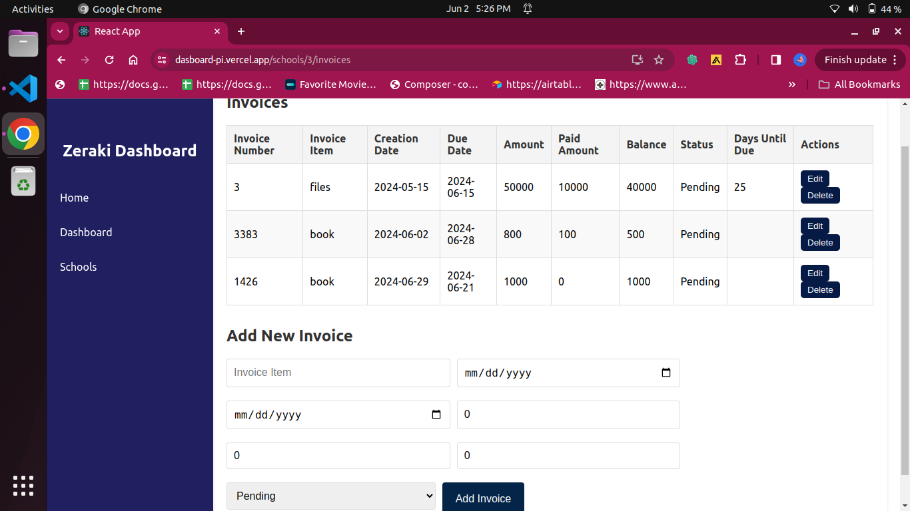
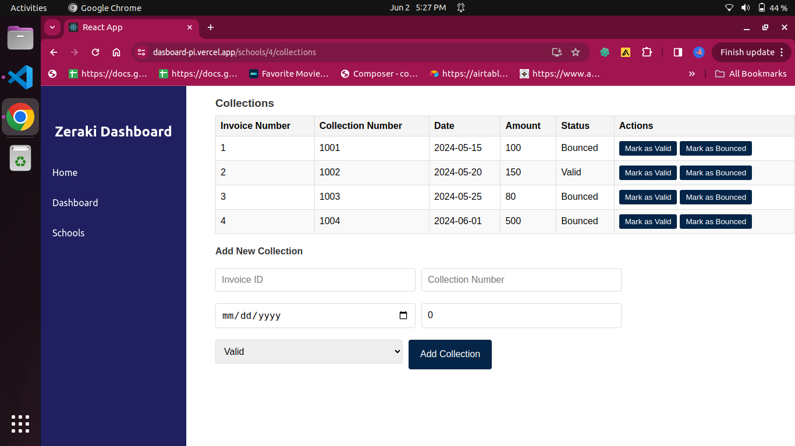

# Zeraki Sales Agent Dashboard

Welcome to the **Zeraki Sales Agent Dashboard**! This application allows you to manage sales, track performance, and revolutionize education across Africa.

## Dashboard's Screenshots and Video 

## Features
Display and manage invoices for each school.
Display a list of schools and their details.
Display and manage collections for each school.
Add, update, and delete invoices and collection records.
Visually appealing landing page.

## Technologies Used
- **React**
- **Axios**
- **JSON Server** (for local development)
- **Vercel** (for deployment)

## Setup Instructions
Prerequisites
Node.js and npm installed
Git installed

## Installation

Clone the repository:
https://github.com/Masian-Parkire/Zeraki-Dashboard.git

cd Zeraki-Dashboard
Install dependencies:
**npm install**

Set up JSON Server for local development:

Create a db.json file in the project root with your initial data:

json

Copy code

{
  "invoices": [],
  
  "collections": []
}
Install JSON Server:

**npm install -g json-server**
Start JSON Server:

json-server --watch db.json --port 3001
Run the application:

**npm start**

